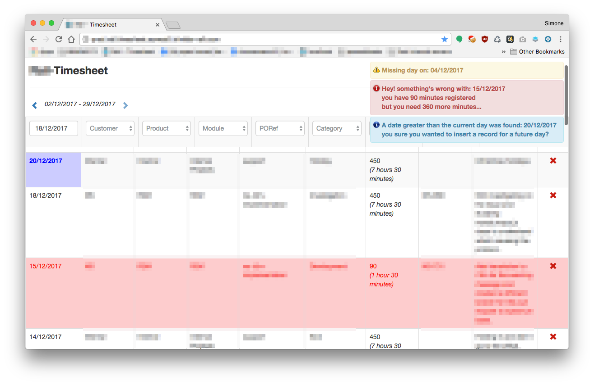
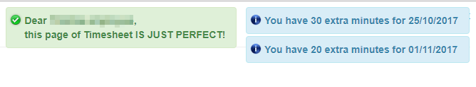

# Timesheet Fixer

## TL;DR

This is a quick a dirty bookmarklet I developed for a [timesheet](https://en.wikipedia.org/wiki/Timesheet) web application I was using in a company. Due to the complexity of the application sometimes it was easy to mess up the minutes for each task, so I created this script for my coworkers to make sure that timesheet page is valid before the project manager closes the month.

Some of the checks are listed below:

* look for missing days;
* check if working hours are correct;
* warn if user has extra hours for a working day;
* warn if user has a future date compared to the current one.

## About

This script was developed to learn a bunch of things with JavaScript. [Babel](https://babeljs.io/repl) was used to minify and transpile the script, [this](https://mrcoles.com/bookmarklet/) bookmarklet creator was used instead to generate the actual link. [Notify.js](https://notifyjs.com/) was used for the notifications.

## Examples

Some notifications which popped up when executing the bookmarklet:

or if timesheet was valid and user had extra minutes for a working day:

